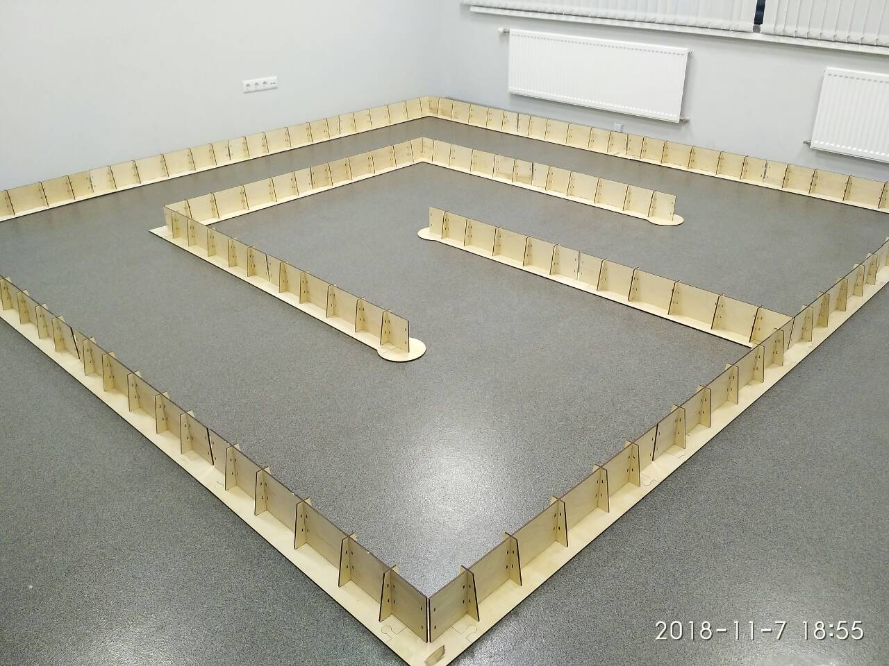
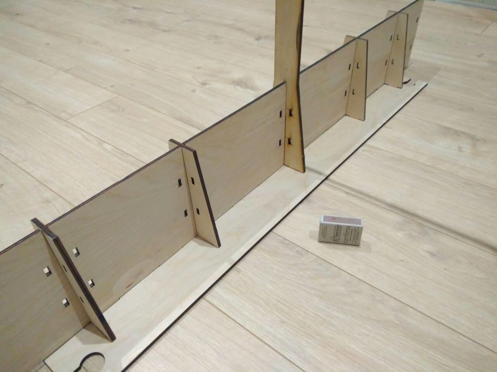

# 2. Игровая зона и действия

Игровое поле является прямоугольной поверхностью (без черных линий) ограниченной бортами (Рис. 1).

Покрытие пола может быть использовано для нанесения рекламных изображений.

Пожалуйста, имейте в виду, что покрытие поверхностей окрашенных областей различных игровых полей может отличаться, также 
оно может ухудшаться по ходу соревнований.

Правила, чертежи и определение поля и игровых элементов могут быть изменены в случае выявления проблем.

Внутренний борт трассы (Рис. 2) будет иметь древесный цвет, наружные борта трассы, невидимые роботам могут быть использованы для нанесения рекламных изображений.

Требования в отношении размеров:
- ширина трассы 950 - 1050 мм;
- борта расположены на краях трассы, высота борта 100 - 170 мм;
- трасса имеет замкнутую траекторию.
- стартовые зоны начинаются за финишной аркой.
