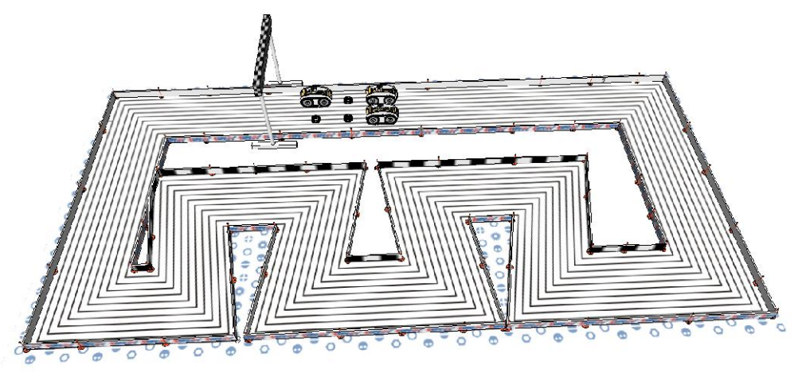
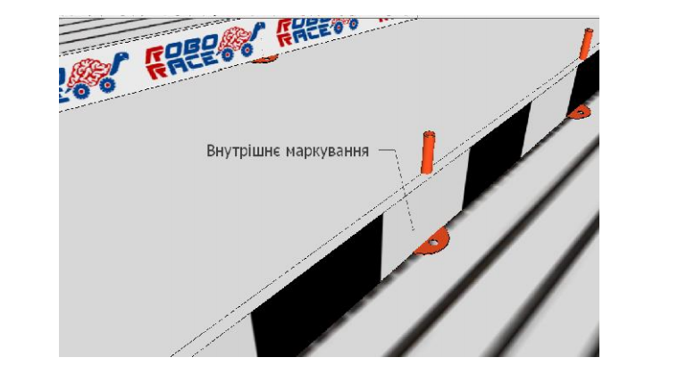
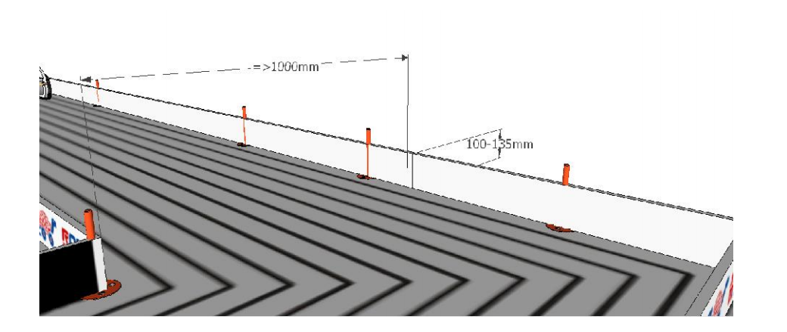
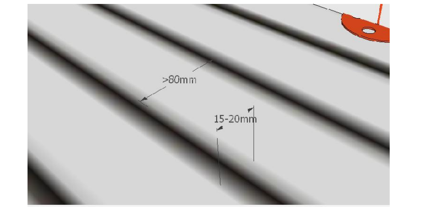
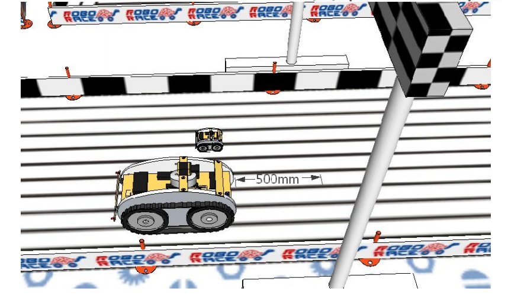

# 2. Игровая зона и действия

Важная информация:

Хотя организаторы и стремятся изготовить игровую зону, как можно ближе к эталону, т.е. поверхность трассы должна быть плоской, возможны незначительные отклонения от оригинальных размеров, любой процесс производства предполагает определенные допуски (в данном случае на размеры). Жалобы, связанные с подобными отклонениями рассматриваться не будут. Если какие-либо изменения будут внесены в чертежи поля и игровых элементов, то они будут опубликованы в дополнительном документе на сайте ROBORACE (http://www.roborace.te.ua).

Пожалуйста, имейте в виду, что покрытие поверхностей окрашенных областей различных игровых полей может отличаться, также оно может ухудшаться по ходу соревнований. Правила, чертежи и определение поля и игровых элементов могут быть изменены в случае выявления проблем. Мы рекомендуем командам регулярно проверять как Сайт ROBORACE http://www.roborace.te.ua/, так и веб-сайт Ассоциации робототехники в Украине http://www.roboart.org.ua/ для проверки наличия подобных обновлений. Командам также следует следить за обсуждениями на http://www.facebook.com/pages/RoboRace/162719923762655 и опубликованной там информацией.

## 2.1. Игровое поле

Игровое поле прямоугольной поверхностью площадью от 50м2, реализованной на белом покрытии с продольными черными линями, а ее края ограничены бортами (Рис. 1).

Рис.1 – Пример игрового поля (трассы)

Один борт трассы, а именно внутренний, то есть хорошо видимый извне трассы, покрытый или вертикальными черно-белыми полосами, или рекламой, для того, чтобы обеспечить ориентирования роботов по коэффициенту отражения от борта. Отношение коэффициентов отражения не менее 1:2. (Рис. 2).

Рис.2 – Пример маркировки внутреннего борта игрового поля

Тип маркировки принимающая сторона объявляет не позднее, чем за две недели до начала тура.

Трасса должна быть гладкой, перед началом соревнований главный судья проводит сертификацию поверхности трассы соответствующим устройством, в случае выявления дефектов принимающая сторона обязана их исправить.

Требования в отношении размеров и линий:

- ширина трассы не менее 1 метра;

- борта белого цвета расположены на краях трассы, высота борта 100 ... 135 мм (Рис. 3);

Рис.3 – Ширина трассы и высота бортов

- продольные черные линии трассы образуют не менее 8-ми замкнутых колец, ширина линии составляет 15 ... 20 мм;

- ширина белой поверхности между линиями и бортами трассы от 80мм (Рис. 4);

Рис.4 – Ширина линий и расстояние между ними

- длина наружного кольца трассы не менее 15;

## 2.2. Зона старта

Стартовые зоны начинаются за финишной аркой на расстоянии 500 мм.

Рис.5 - Схема стартового размещения роботов в заезде
