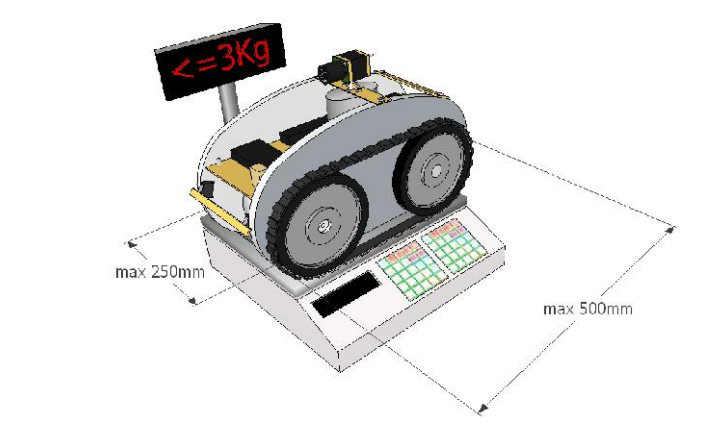

# 3. Роботы

## 3.1. Общие положения

* Каждая команда может представить одного и более автономных роботов. 
* Умышленное нанесение повреждений роботам, игровому полю и любым другим элементам игровой зоны запрещены. 
* Роботы должны быть сделаны из хорошо соединенных частей (части роботов не должны оставаться на игровом поле во время 
заезда). 

## 3.2. Размеры

Размеры роботов. Автономная модель робота должна иметь механические возможности преодоления соответствующего расстояния 
с возможными изменениями траектории движения, а также отвечать следующим требованиям:
1. Максимальная ширина - 250 мм, длина - 500 мм, высота - 300 мм.
2. Масса не должна превышать 3 кг. На рис.6 показаны ограничения на размер роботов:

Рис.6 – Максимальные габаритные размеры и масса робота

## 3.3. Источники энергии

* Разрешены любые источники энергии, встроенные в робот (батареи, сжатый воздух, ...), за исключением 
источников энергии, использующей химические реакции, такие как горение или взрыв, которые запрещены по соображениям 
безопасности. Кроме того, запрещено использование коррозионных соединений и распыление жидкостей.
* Если у вас есть сомнения относительно необычного источника энергии, лучше заранее посоветуйтесь с главным судьей.

## 3.5. Безопасность

### 3.5.1. Общие положения

* Все системы должны соответствовать существующим национальным и европейским законам и стандартам. В частности, 
используемые системы должны соответствовать официальным нормам безопасности жизнедеятельности и быть безопасными для 
участников и зрителей во время и вне матчами (например, в боксах команды или в процессе ожидания / подготовки заезда). 
* У роботов не должно быть никаких опасных устройств или острых частей, которые могут стать причиной телесного 
повреждения. 
* Запрещается использование жидких, едких и пиротехнических материалов или живых существ в роботе. 
* Все роботы должны соответствовать официальным стандартам «низкого напряжения». То есть электрическое напряжение, 
используемая в роботе, не должна превышать 48 В. Напряжения выше 48 В могут быть использованы только внутри закрытых 
устройств, сделанных промышленным способом (таких как лазеры, подсветка LCD панели), и только если эти устройства не 
были модифицированы командой, и если они отвечают национальным и Европейским нормативным требованиям. 
* Как правило, любой механизм или система, признана главным судьей как потенциально опасная, будет запрещена к применению и 
должна быть удалена из робота к соревнованиям, иначе команда будет дисквалифицирована с соревнований.

### 3.5.2. Лазеры

Лазерные системы рассматриваются на основании классов лазерных устройств (стандарт "EN60825-1:2007, выпуск 2 - 
Безопасность лазерной продукции - Часть 1 - Классификация и требования к оборудованию). Команды, использующие лазеры, 
должны предоставить параметры оборудования согласно классификации или спецификацию компонента с лазером. Без подобных 
документов, робота не допустят к соревнованиям. Согласно классификации, разрешается использовать лазеры класса 1, 1М. 
Лазеры класса 2 и 2М разрешены только в том случае, если лазерный луч ни при каких условиях не будет выходить за пределы 
игровой площадки. Все остальные классы (3R, 3B и 4) строго запрещены. Разборка или изменение устройств, использующих 
источники лазерного излучения, часто ведут к изменению класса устройства. Лазерные устройства должны быть использованы в 
той форме, в которой они доступны на рынке (лазерное устройство = источник излучения + электроника + оптика). При использовании источника света высокой мощности, обратите внимание на то, что он может быть опасен 
для глаз человека при прямом попадании света в глаза. Обратите внимание, что некоторые мощные светодиодные устройства 
могут превышать опасное пороговое ограничение. Будьте ответственны! Ваши роботы выступают перед аудиторией, которая не 
проинформирована об особенностях каждого робота.
