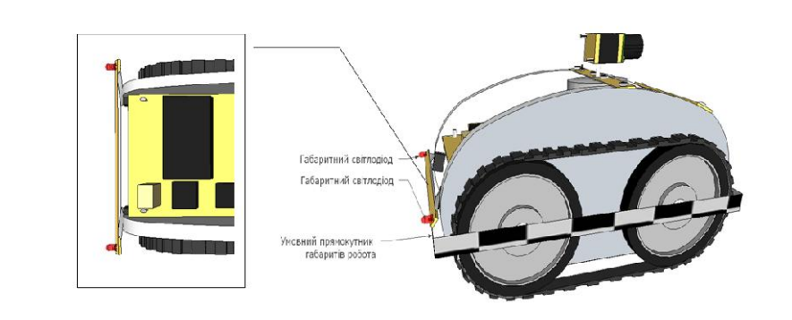
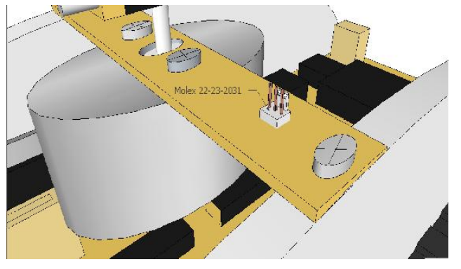
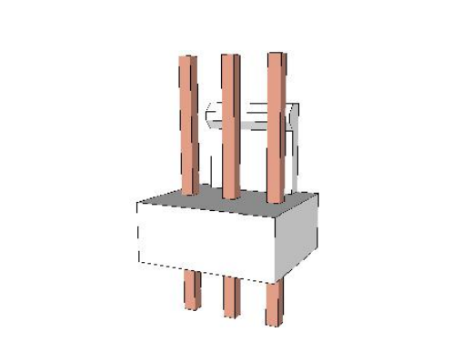
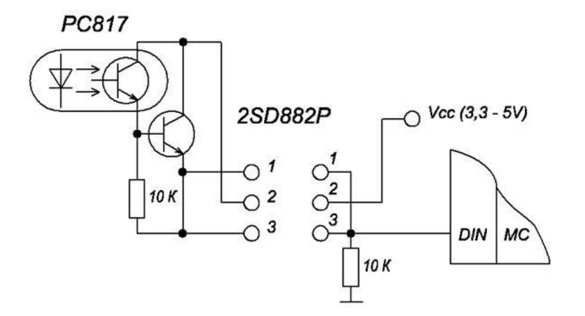

# 3. Роботы
## 3.1. Общие положения
* Каждая команда может представить одного и более автономных роботов разных размеров,
которые не противоречат ограничением до размеров и массы, указанных в регламенте. 
* Создание дополнительного работа не обязательно. Командам-новичкам рекомендуется
работать только над одним роботом. 
* Умышленное нанесение повреждений роботу (-ам) соперника, игровому полю и любым
другим элементам игровой зоны запрещены. 
* Работы должны быть сделаны из хорошо соединенных частей (части роботов не должны
оставаться на игровом поле во время заезда). 
* Работы не будут допущены к соревнованиям, если они используют системы, которые
специально разработаны для создания вибрации игрового поля или выполняющие другие
недозволенные действия. Если у вас возникли сомнения относительно этого пункта - обращайтесь к
судьям.
## 3.2. Размеры
Размеры роботов. Автономная модель робота должна иметь механические возможности преодоления
соответствующего расстояния с возможными изменениями траектории движения, а также
отвечать следующим требованиям:
1. Максимальная ширина - 250 мм, длина - 500 мм.
2. Вес не должен превышать 3 кг. На рис.6 показаны ограничения на периметр роботов:

Рис.6. – Максимальные габаритные размеры и масса работа

3. Робот должен иметь задние габаритные огни - красный светодиод диаметром 5 мм и углом
рассеяния не менее 60 град., Направлен назад и размещен не более чем на 1 см от боковой стороны
описанного вокруг робота прямоугольника (Рис. 6a)

Рис.6a. – Пример размещения габаритных светодиодов

## 3.3. Источники энергии
* Разрешены любые источники энергии, встроенные в робот (батареи, сжатый воздух, энергия
гравитации ...), за исключением источников энергии, использующей химические реакции, такие как
горение или взрыв, которые запрещены по соображениям безопасности. Кроме того, запрещено
использование коррозионных соединений и распыление жидкостей.
* Если у вас есть сомнения относительно необычного источника энергии, лучше заранее
посоветуйтесь с судейским комитетом.
* Для предотвращения возгорания рекомендуется обращать особое внимание на выбор
проводников в зависимости от тока, проходящего через них. Кроме того, рекомендуется защитить
систему питания, установив предохранитель как можно ближе к аккумулятору.
* Работы должны быть в состоянии участвовать в трех играх подряд. Обратите внимание, что
это время помимо прочего включает период ожидания, во время которого робот включен и готов к
старту. Поэтому мы рекомендуем командам приготовить несколько наборов аккумуляторов и
обеспечить легкий доступ к ним для проведения замены в случае необходимости. Всегда держите
наготове набор полностью заряженных аккумуляторов.
## 3.4. Другие требования к роботам
### 3.4.1. Стартовое устройство
Стартовое устройство на работе(-ах) должно быть легким и доступным. Для этого на верхней
части работа (Рис. 7а) должен быть выведен разъем Molex 22-23-2031 вилка на плату 2.54 мм
открытая (рис. 7б)

             а)                                         б)
Рис.7. – Коннектор Molex 22-23-2031 (а - пример размещения, б - внешний вид)
Разъем предназначен для модуля системы «массового старта», который выполнен по схеме
оптокнопкы (Рис. 8).

Рис.8. – Схема оптокнопки системы «массового старта»

Подключение контактов разъема: 1pin - GND, 2pin - +5 V, 3pin - In (0/1).
Вход In имеет два состояния логический 0 и 1, при 0 - робот должен остановиться, при 1 - разрешено двигаться.
Стартовое устройство выдается для каждого робота, который прошел квалификацию, и крепится
в разъем Molex 22-23-2031 на верхней части работа.
При неисправности системы массового старта - запуск роботов осуществляется в ручном
режиме с участием членов команд. Детальная процедура ручного старта определяется главным
судьей во время тура.
### 3.4.2. Кнопка аварийного выключения
В работа должна быть кнопка аварийного выключения красного цвета и диаметром как минимум
20 мм. Ее следует разместить в верхней части работа, в безопасном и видном месте, легко доступном
для судей в любой момент матча. Активация кнопки должна происходить от простого
поступательного движения вниз (например, нажатие ладонью).
Сразу после активации кнопки аварийного выключения должна прекратиться работа всех
приводов работа, оставляя их в свободном состоянии (т.е. не в состоянии активного торможения, а
обесточенными).
### 3.4.3. Система предотвращения столкновений
Команды обязаны оборудовать работа системой предотвращения столкновений. Эта система
предусмотрена для исключения столкновений роботов между собой и, как следствие, исключения
повреждений роботов во время матча.
Это требование будет проверена на стадии допуска к соревнованиям. Командам запрещается
намеренно отключать эту систему после прохождения проверок.
## 3.5. Безопасность
### 3.5.1. Общие положения
* Все системы должны соответствовать существующим национальным и европейским законам
и стандартам. В частности, используемые системы должны соответствовать официальным нормам
безопасности жизнедеятельности и быть безопасными для участников и зрителей во время и вне
матчами (например, в боксах команды или в процессе ожидания / подготовки заезда). 
* У роботов не должно быть никаких опасных устройств или острых частей, которые могут
стать причиной телесного повреждения. 
* Запрещается использование жидких, едких и пиротехнических материалов или живых
существ в работе. 
* Все работы должны соответствовать официальным стандартам «низкого напряжения». То
есть электрическое напряжение, используемая в работе, не должна превышать 48 В. Напряжения
выше 48 В могут быть использованы только внутри закрытых устройств, сделанных промышленным
способом (таких как лазеры, подсветка LCD панели), и только если эти устройства не были
модифицированы командой, и если они отвечают национальным и Европейским нормативным
требованиям. 
* Как правило, любой механизм или система, признана судьями как потенциально опасная,
будет запрещена к применению и должна быть удалена из робота к соревнованиям, иначе команда
будет дисквалифицирована с соревнований.
### 3.5.2. Лазеры
Лазерные системы рассматриваются на основании классов лазерных устройств (стандарт "EN
60825-1:2007, выпуск 2 - Безопасность лазерной продукции - Часть 1 - Классификация и требования к оборудованию). Команды, использующие лазеры,
должны предоставить параметры оборудования согласно классификации или
спецификацию компонента с лазером. Без подобных документов, работа не допустят к
соревнованиям.
Согласно классификации, разрешается использовать лазеры класса 1, 1М.
Лазеры класса 2 и 2М разрешены только в том случае, если лазерный луч ни при каких условиях
не будет выходить за пределы игровой площадки.
Все остальные классы (3R, 3B и 4) строго запрещены.
Разборка или изменение устройств, использующих источники лазерного излучения, часто ведут к
изменению класса устройства. Лазерные устройства должны быть использованы в той форме, в которой они
доступны на рынке (лазерное устройство = источник излучения + электроника + оптика).
Мощные источники света
При использовании источника света высокой мощности, обратите внимание на то, что он может
быть опасен для глаз человека при прямом попадании света в глаза.
Обратите внимание, что некоторые мощные светодиодные устройства могут превышать опасное
пороговое ограничение.
Будьте ответственны! Ваши работы выступают перед аудиторией, которая не проинформирована
об особенностях каждого робота.
### 3.5.3. Аккумуляторы на основе лития
Использование батарей на основе лития (например, Li - ion / Li - Po / Li - Fe) разрешается при
соблюдении следующих условий: 
* Соответствующее зарядное устройство должно быть предоставлено на стадии допуска к
соревнованиям; 
* Батареи постоянно хранятся в специальном огнеупорном контейнере (например, огнеупорном
футляре), как во время соревнований, так и в боксах участников, а также при транспортировке
работа.
Рекомендуется обеспечивать работа системой обнаружения разряда батарей.
Эти ограничения снимаются только в случае использования батарей в составе Lego ™ Mindstorm
/ ноутбука / мобильного телефона и только до тех пор, пока: 
* они не вынуты из "родного" устройства; 
* они используются по назначению, которое определил производитель..
