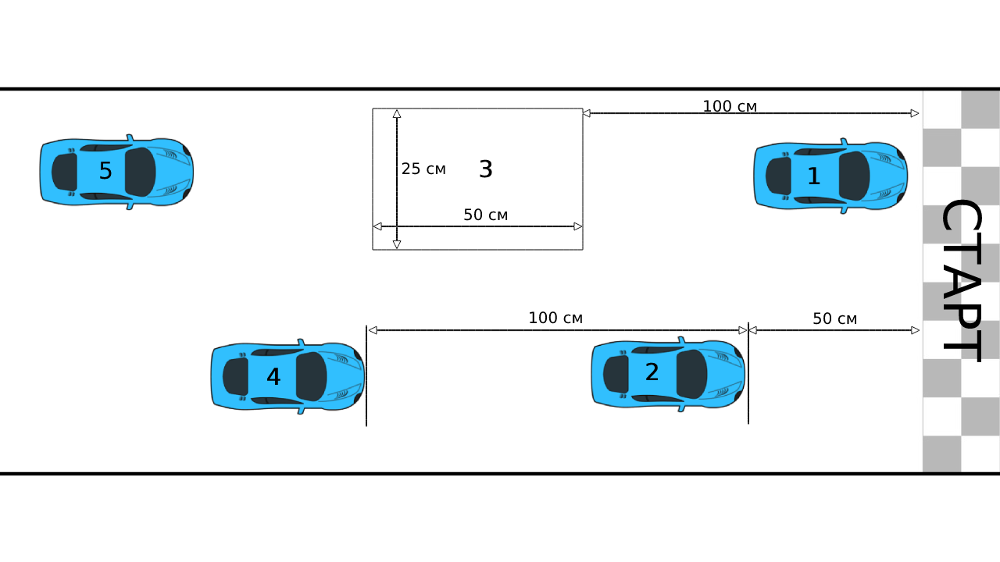

# 4. Заезды

Заезды бывают трех типов: квалификационные, отборочные и финальные.

Направление движения по трассе определяет главный судья до начала соревнований (рекомендуется двигаться по часовой стрелке в зоне старта).

## Квалификация

Квалификационный заезд выполняется при проверке робота.

Задача: проехать один круг трассы в нужном направлении. Старт и остановка осуществляется по сигналу судьи. Учитывается минимальное время из не более 3-х попыток. Квалификационные заезды могут осуществляться во время отведенное для тренировок.

Главный судья устанавливает ограничение по времени для квалификационного заезда. Заезд останавливается при достижении заданного времени и попытка не засчитывается.

## Отборочные и финальные заезды

Задача: проехать максимальное количество кругов, за установленное время. Старт и остановка осуществляется по сигналу судьи.
Ограничение заездов по времени устанавливается главным судьей соревнований. Рекомендуется выбирать время для отборочных заездов 5-10 минут и для финального заезда 10-20 минут.

## Проведение отборочных и финальных заездов

### Подготовка к заезду

Схема размещения роботов в зоне старта показана на Рис.4. Робот с лучшим результатом занимает поул-позицию (позиция на старте возле борта, соответствующего ближайшему повороту). За поул-позицией становятся роботы с нечетными номерами, а у противоположного борта трассы с четными.

Рис.4 – Схема размещения роботов в зоне старта

Робот должен начинать движение в начале заезда и после пит-стопа из положения в котором он проходил процедуру допуска, при этом проверочная рамка устанавливается длинной стороной вдоль борта трассы.

Перед началом очередного заезда у каждой команды есть 5 минут, чтобы подготовить робота(ов) к заеду. Робот, который не готов к заезду по истечении 5 минут, дисквалифицируется с него. По готовности команд судья проводит обратный отсчет и старт заезда.

### Старт заезда

Старт роботов происходит с помощью "системы массового старта", при этом робот должен начать движение при получении сигнала от системы.
При ручном запуске (в случае отсутствия системы) представитель команды производит активацию робота после стартового сигнала, при этом робот должен начать движение через 5 секунд. После активации необходимо быстро и аккуратно, не мешая другим роботам и участникам, покинуть трассу. Нахождение участников на трассе после старта недопустимо.

Любые внешние действия участников на робота другой команды могут привести к дисквалификации команды из заезда.

### Подсчет кругов

Подсчет пройденных кругов и времени осуществляет электронная система, при ее отсутствии эту операцию осуществляют судьи. Каждая команда имеет право дублировать подсчет кругов и времени своего робота.

При прохождении роботом финишной линии в нужном направлении количество пройденных кругов увеличивается, при движении в обратном - уменьшается.

### Остановка заезда

Главный судья имеет право остановить заезд: при выявлении нарушений регламента или по общему согласию участников заезда.
После выполнения задания, то есть по окончанию времени заезда, робот должен быть снят с трассы представителем команды, при этом судьи фиксируют пройденное количество кругов и затраченное время. Затем судьи объявляют результат каждого робота в заезде.

Главный судья имеет право дисквалифицировать робота по итогам или во время заезда, указав на причины дисквалификации. При этом результаты заезда аннулируются.

Если во время заезда создалась пробка, и роботы не могут продолжать движение, судья может принять решение о ручном урегулировании пробки.

### Пит-стопы

Запрещается трогать роботов после старта.
У каждой команды есть право на неограниченное количество пит-стопов в заезде. Порядок проведения пит-стопа:
1. Заявить судье о необходимости пит-стопа указав номер робота и местоположение
2. Судья снимает робота с трассы и передаёт участнику (или разрешает участнику снять робота)
3. Время пит-стопа не менее 1 минуты. т.е. нельзя продолжать движение до окончания времени пит-стопа
4. Участник может отремонтировать робота, заменить запасные части и/или программу
5. Когда время пит-стопа завершено и робот готов продолжать гонку, его можно поставить на трассу в зоне старта по разрешению судьи.
6. Участник имеет право не возвращать робота после пит-стопа, при этом результат заезда не аннулируется.

## Определение победителя заезда

В заезде выигрывает робот проехавший максимальное количество кругов, или, в случае равенства кругов, робот, затративший наименьшее время для преодоления этих кругов.
