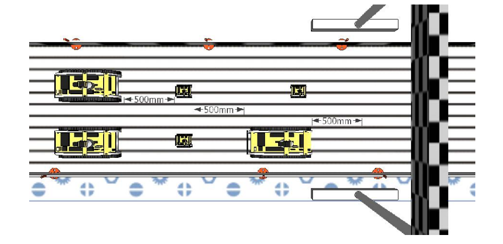

# 4. Заезды

Заезды бывают трех типов: квалификационные, отборочные, финальные.

## Квалификация

Квалификационный заезд выполняется при сертификации робота.

Задача: проехать один круг трассы. Старт и остановка осуществляется по сигналу судьи. Количество попыток до 3 и может осуществляться во время, отведенное для тренировок.

Время квалификации засчитывается лучшее время прохождения круга из 3х попыток.

## Отборочные заезды

Отборочные заезды выполняется в общем зачете отборочного тура.

Задача: проехать определенное количество кругов, регламентированное общими положениями для отборочных заездов. Старт и остановка осуществляется по сигналу судьи. Роботу разрешено участвовать только в двух отборочных заездах.

## Финальный заезд

Финальный заезд выполняется по результатам общего отборочного зачет тура.

Задача: проехать определенное количество кругов, определенное главным судьей. Старт и остановка осуществляется по сигналу судьи. 

## Подготовка к заезду

Схема размещения роботов в начале каждого заезда показана на Рис. 4. робот с лучшим временем занимает поул позицию. За поул позицией становятся роботы с нечетными номерами, а у противоположного борта трассы с четными.

Перед началом очередного заезда у каждой команды есть 5 минут, чтобы подготовить робота(ов) к работе на игровом поле. Робот, который не готов к работе по истечении 5 минут, дисквалифицируется с заезда. Когда команды приготовили своих роботов, судья спрашивает участников об их готовности и проводит обратный отсчет и старт заезда.

## Ход заезда

После того как судья даст стартовый сигнал, робот должен быть активирован. Ни при каких обстоятельствах не разрешается толкать или поправлять роботов.

Робот должен начать движение через 5 секунд после старта.

Любые внешние действия участников на робота другой команды могут привести к дисквалификации команды из заезда.

Подсчет пройденных кругов и времени осуществляет электронная система, при ее отсутствии эту операцию осуществляют судьи.

Каждая команда имеет право дублировать подсчет кругов и времени своего робота.

Главный судья имеет право остановить заезд: при выявлении нарушений регламента или по общему согласию участников заезда.
После выполнения задания, то есть полного прохождения роботом определенного количества кругов (окончания времени заезда), робот может быть снят с трассы представителем команды при этом судьи фиксируют затраченное время (пройденное количество кругов). Затем судьи объявляют результат каждого робота в заезде.

Команда объявляется дисквалифицированной с заезда, если робот команды полностью не покинул стартовой зоны в течение заезда, или если главный судья вынесет соответствующее решение по итогам матча указав на причины дисквалификации.

В случае если робот не может продолжать движение то с разрешения главного судьи можно снять робота для устранения неисправностей. При этом количество кругов которые проехал робот обнуляется.
